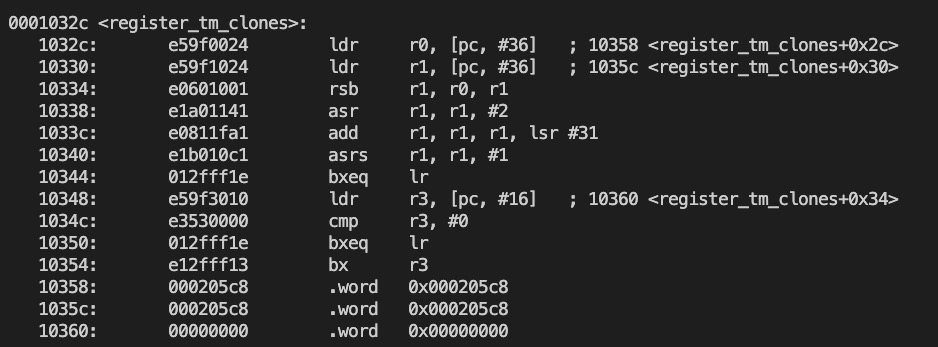
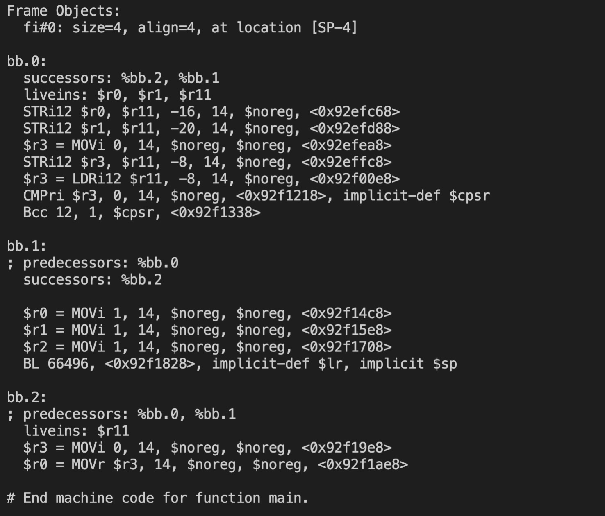
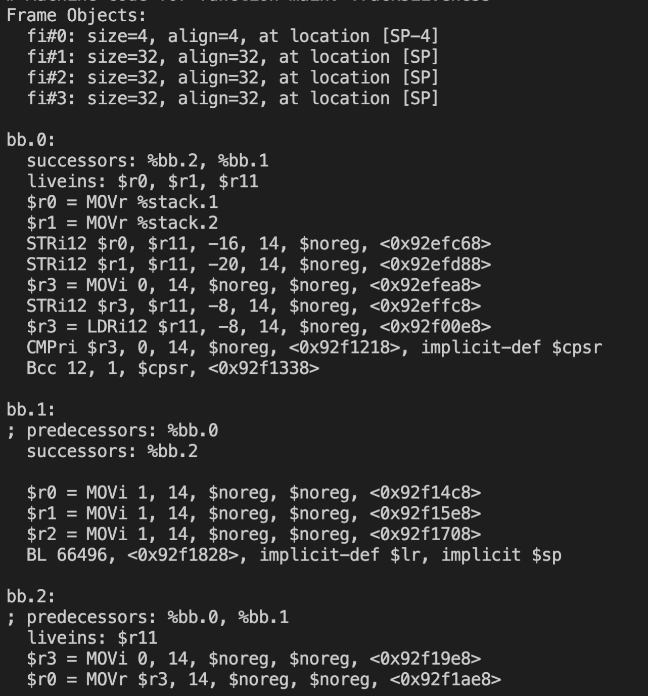
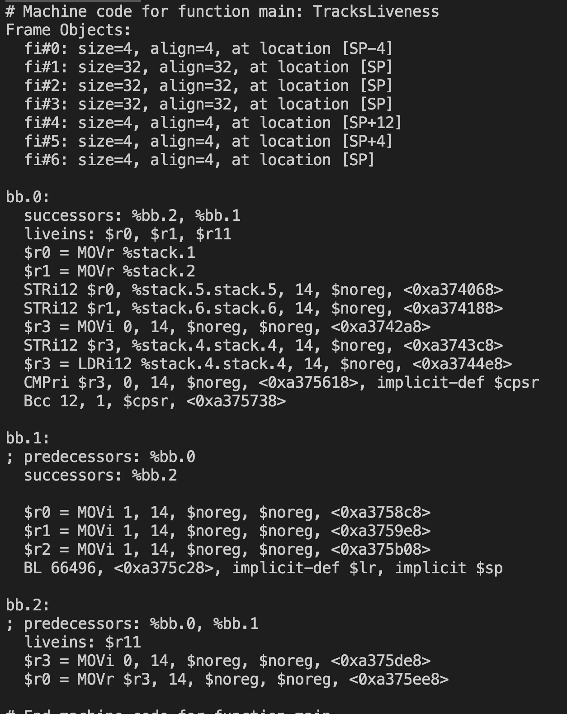

# Build & Install
See https://github.com/microsoft/llvm-mctoll

# Develop
First make sure your path is in `/home/ychen/LLVM`\

source code: /home/ychen/LLVM/llvm/tools/llvm-mctoll, after modifying the source code, use `cmake --build build  -- llvm-mctoll` in `/home/ychen/LLVM`to rebuild the project

# Makefile
see /home/ychen/LLVM/makefile: 
1. build-xxx(x86, arm, riscv), compile test .c file to the target .o file
2. objudmp-xxx, disassemble the test binary .o file
3. test-xxx, use llvm-mctoll to lift the test binary .o file, use `-debug` to turn on the middle log, it is very helpful for understanding the mctoll principle

# 8 Steps for lifting the binary For ARM AND RISCV
see /home/ychen/LLVM/llvm/tools/llvm-mctoll/ARM/ARMMachineInstructionRaiser.cpp: 

1. discover function prototype(in `ARM/RISCV FunctionPrototype.cpp`): discover #num of arguments and (return, arguments) types. For ARM, return value is stored in ARM::RO, first 4 arguments are stored in ARM::R0 - ARM::R3, other arguments are on stack(may exist bugs here, because for func with four than 4 arguments, can't see the 5-8 arguments in objdump, these aruguments are not on stack, and i don't know why). For riscv, return value is stored in RISCV::X10, first 8 aruguments are in RISCV::X10 - RISCV::X17, other arguments may be on stack (To do). 
    
2. MIRevising(in `ARM/RISCV MIRRevising.cpp`):
    
    2.1 decodeModImm: For instruction `orrri op0, op1, op2`,  the lower 8 bits of op2(0xFF) stores the raw value, the higher 4 bits (0xF00) of right rot bits, this step calculates the value after rotating(Bits >> Rot) and store it. This step is unnecssary for risc-v.

    2.2 discover branch instruction `[bl / bl_pred / bcc] address` 's absolute address. The address in instruction is the relative address(which is the offset to the current instruction's address), so we need first get the current instruction's absolute address(in variable `CallAddr`), then use it to calculate the target jump address(in variable `CallTargetIndex`). However, in some case, the target jump address is not in the same section, and we need to check if the function exists(also search PLT for the func). Current i only implment the `jal` instruction for risc-v. To do : add other branch target function: jalr, beq, bne, bge, blt, bltu, begu.

    2.3 In arm, there may exist data in text section like this , arm use ldr r3, [pc, #20] to load the data, however, as the instructions are executed, the PC changes all the time, so we can use the offset + pc to locate the data in text section, so in this step we transfer ldr r3, [pc, #20] to ldr r3, @globalvalue, here @globalvalue is the abosulte address for the data in text seaction. This step is unnecessary for risc-v and x86 because they don't have date in text section.

3. Eliminate PrologEpilog(in `ARM/RISCV EliminatePrologEpilog.cpp`): when entering a function, we need to modify the sp and fp register, this is called prolog, when leaving a function, we also need to modify the sp and fp register, this is called epilog. In arm, `str fp, [sp, #-4]!` and `add fp, sp, #0` form a prolog, `sub sp, fp, #0` and `ldr fp, [sp], #4` form a epilog, also there exist other prologs and epilogs(see comments in line 55). In this step, we need to eliminate the prologs and epilogs in machine instruction, then Save the CalleeSaved register in CSI, and allocate stack slots for CalleeSaved register in CSI.  For RISC-V, `addi sp,sp,-48, sw ra,44(sp), sw s0,40(sp), addi s0,sp,48` and `lw ra, 44(sp), lw s0, 40(sp), addi sp,sp,48` form one gourp of prolog and epilog, we need to eliminate these prologepilogs. To do: there may exist other prologs and epilogs in risc-v. 
 
4. CreateJumpTable, deal with long jump, still unsure in which situation 'add r0, pc, #8' exists

5. ArgumentRaiser(In `ARMArgumentRaiser.cpp`): this step add serveral machine instruction: first create stack object and then use `$r0 = MOVr %stack.1`, `$r1 = MOVr %stack.2` machine instructions to move function arugments from stack to registers.

Before ArgumentRaiser

After ArgumentRaise

6. FrameBuilder: First replace common regs assigned by SP to SP, which means replace machine instructions from `mov r5, sp; ldr r3, [r5, #4]` to `ldr r3, [sp, #4]`. Then analyze frame index of stack operands, such as `ldr r3, [sp, #12]`, `str r4, [fp, #-8]`, and `add r0, sp, #imm`, get the offset from the instruction,  build a map `SPOffElementMap` from offset to stackElement and a map `InstrToElementMap` from machine instruction to stackElement.  Then generate stackobjects for stack element in `SPOffElementMap`. And replace original SP operands by stack operands in `InstrToElementMap`. 
 
Example : STRi12 $r0, $r11, -16, 14, $noreg, <0x8b57068> -> STRi12 $r0, %stack.5.stack.5, 14, $noreg, <0x8b57068>.

Before FrameBuilder

After FrameBuilder

7. InstructionSplitting, split complex arm instructions (such as `LDRSH/LDRSB/LDRH/LDRD`) to serveral simple instructions, this step is unnecssary for risc-v.

8. SelectionDAGISel, 

    8.1 machine instruction -> SDNode
    
    8.2 SDNode -> LLVM IR 

# Notion
Mctoll now can only lift 32-bit arm, 64 bit-arm is unsupported, besides, there are some bugs for lifting arm32, such as mctoll can't discover function prototype for arguments more than 4.

# Compiler
32-bit arm compiler : `/home/ychen/gcc/tools/arm-bcm2708/arm-linux-gnueabihf/bin/arm-linux-gnueabihf-gcc`

risc-v risc-v compiler : `/work/stu/ychen/riscv32-gcc-linux/bin/riscv32-unknown-linux-gnu-gcc`